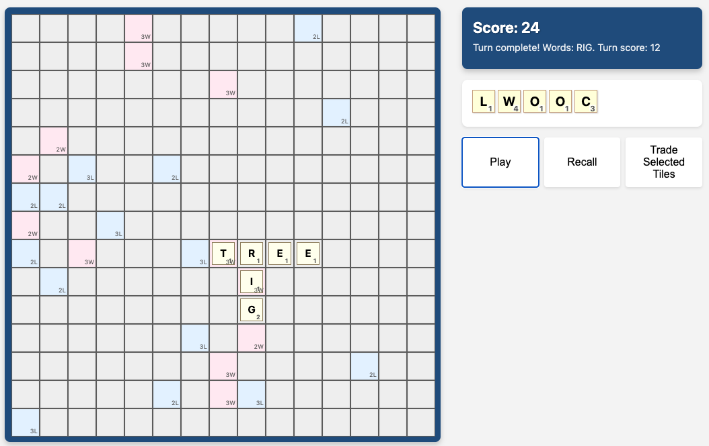

# Skwabble

A browser-based word game where you strategically place letters on a board to form words and score points.

# Demo

The game demo can be played on [github pages](https://dolan.github.io/skwabble/index.html)

## How to Play

1. **Place Letters**: Drag and drop letters from your tray onto the board to form words. Letters must be placed in a continuous line, either horizontally or vertically.

2. **Score Points**: Each letter has a point value. Special bonus squares on the board can multiply your score:
   - `2L`: Double letter score
   - `3L`: Triple letter score
   - `2W`: Double word score
   - `3W`: Triple word score

3. **Form Words**: Create valid dictionary words. When you place new letters, they can form multiple words by connecting with existing letters on the board.

4. **Special Bonuses**: Use all 7 letters in a single turn to earn a 50-point bonus!

## Controls

- **Drag & Drop**: Drag letters from your tray to place them on the board
- **Click**: Click a letter in your tray to select it, then click a board space to place it
- **Withdraw**: Click any letter placed in your current turn to return it to your tray
- **Trade**: Select letters in your tray and click "Trade Selected Tiles" to exchange them for new ones
- **End Turn**: Click "End Turn" when you're satisfied with your word placement

## Features

- Real-time word validation against a dictionary
- Automatic scoring with bonus tile multipliers
- Random bonus tile placement for varied gameplay
- Drag-and-drop interface
- Letter trading system
- Turn-based gameplay

## Technical Details

Built using vanilla JavaScript, HTML, and CSS. The game features:
- Drag-and-drop API for smooth tile placement
- SQLite-based dictionary for word validation
- CSS Grid for the game board layout
- Modular JavaScript class structure

## Getting Started

1. Clone the repository
2. Open `index.html` in a modern web browser
3. Start placing letters and forming words!

## License

This project is open source and available under the MIT License. 

Dictionary file created from unofficial word list 
https://gist.github.com/deostroll/7693b6f3d48b44a89ee5f57bf750bd32

